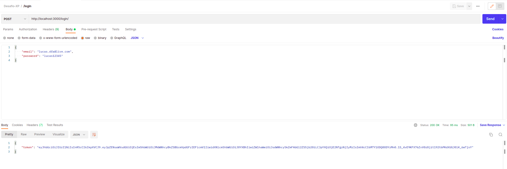
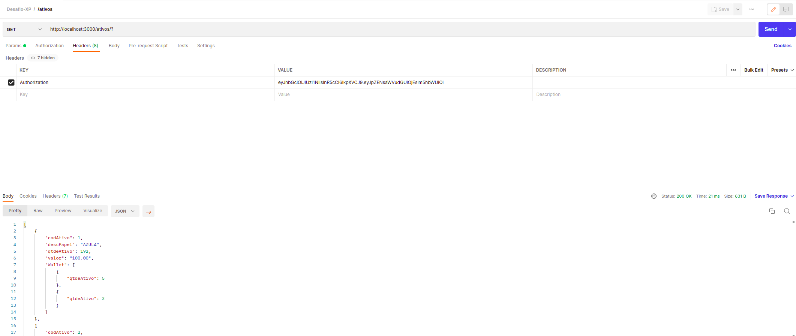
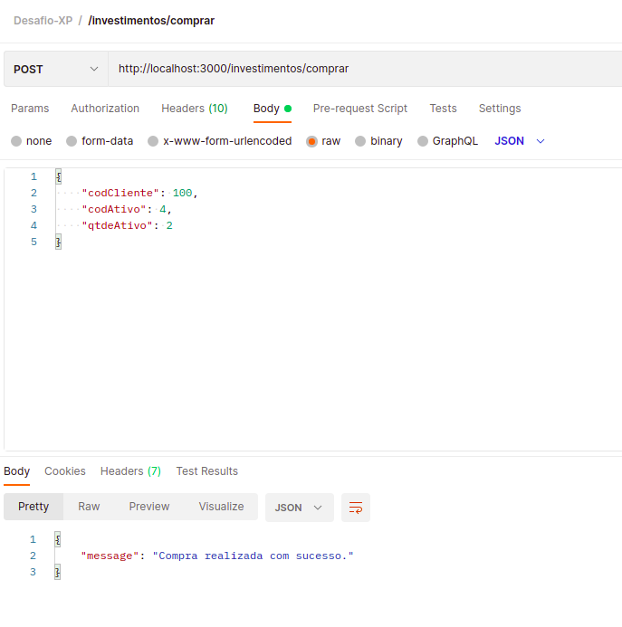
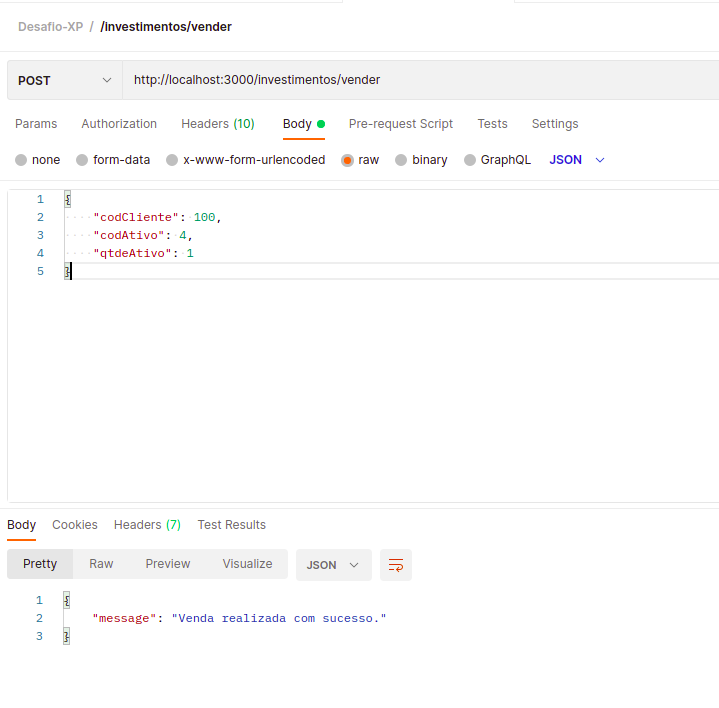
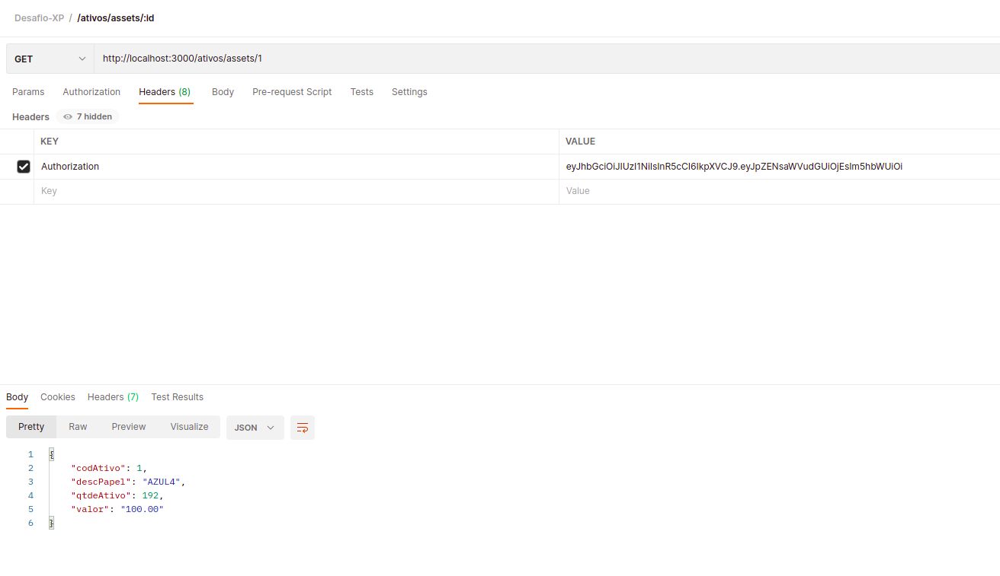
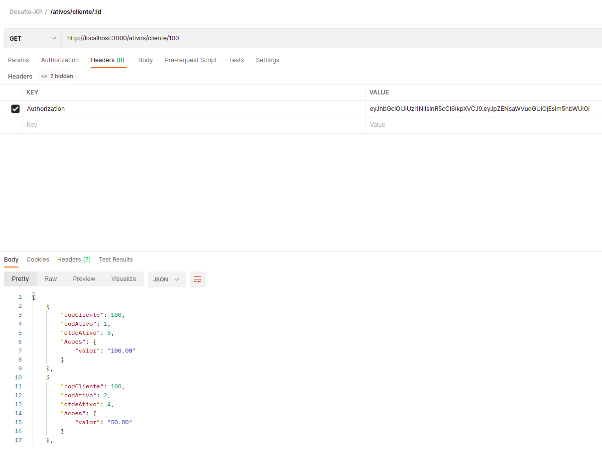
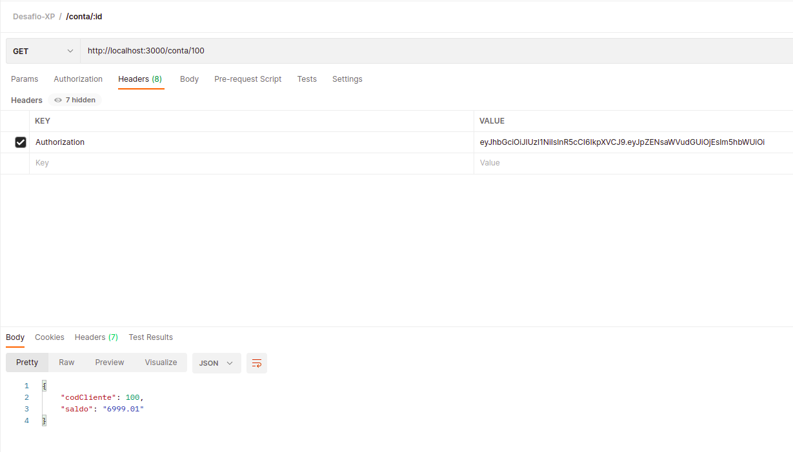
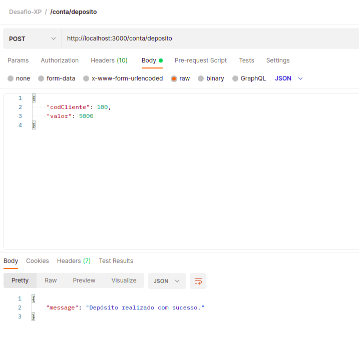
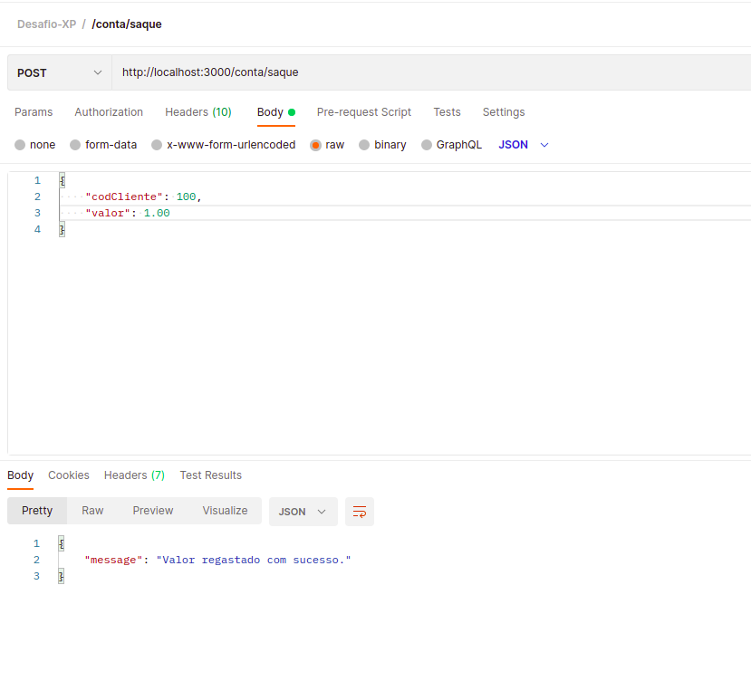

# Boas-Vindas ao repositório do projeto Desafio Técnico XP Inc - BackEnd
=================================================

Este projeto faz parte do processo seletivo da XP Inc voltado aos alunos da Trybe Turma XP - 18. O projeto tem como finalidade testar os conhecimentos dos alunos sobre os temas abordados
no curso da Trybe na área de Back End afim de alinhar conhecimento e qualificar os alunos a futuras oportunidades.
Este é um arquivo README que irá explicar todo processo de desenvolvimento do projeto e como faze-lo funcionar.

[](https://creativecommons.org/publicdomain/zero/1.0/)
[]
[]


Índice
-----------------

* [ Introdução ](#introdução)
* [ Tecnologias Utilizadas ](#tecnologias)
* [ Instalação ](#instalação)
* [ Uso ](#uso)
* [ Problemas e limitações conhecidos ](#known-issues-and-limitations)
* [ Obtendo ajuda ](#getting-help)
* [ Contribuindo ](#contribuindo)
* [ Licença ](#licença)
* [ Autores e história ](#autores-e-história)
* [ Agradecimentos ](#agradecimentos)


Introdução
------------

O desafio foi criar uma API que retornasse informações para o Front-End/Mobile que simulasse uma aplicação de compra e venda de ações, manutenção de conta e geração/autenticação de usuários.

Tecnologias Utilizadas
------------
<details>
  <summary><strong> Tecnologias </strong></summary>

1. JavaScript
2. NodeJS
3. Express
4. JOI
5. Sequelize
6. JWT
7. ESLINT
8. Heroku
9. Swagger
10. Docker

</details>

Instalação
------------
<details>
  <summary><strong>🐋 Rodando no Docker vs Localmente</strong></summary>
  
  ## 👉 Com Docker
 
  **:warning: Antes de começar, seu docker-compose precisa estar na versão 1.29 ou superior. [Veja aqui](https://www.digitalocean.com/community/tutorials/how-to-install-and-use-docker-compose-on-ubuntu-20-04-pt) ou [na documentação](https://docs.docker.com/compose/install/) como instalá-lo. No primeiro artigo, você pode substituir onde está com `1.26.0` por `1.29.2`.**


  > :information_source: Rode os serviços `node` e `db` com o comando `docker-compose up -d --build`.

  - Lembre-se de parar o `mysql` se estiver usando localmente na porta padrão (`3306`), ou adapte, caso queria fazer uso da aplicação em containers;

  - Esses serviços irão inicializar um container chamado `xp-desafio` e outro chamado `xp-desafio-bd`;

  - A partir daqui você pode rodar o container `xp-desafio` via CLI ou abri-lo no VS Code;

  > :information_source: Use o comando
  ```bash
    docker exec -it xp-desafio bash
  ```

  - Ele te dará acesso ao terminal interativo do container criado pelo compose, que está rodando em segundo plano.

  > :information_source: Instale as dependências [**Caso existam**] com
  ```bash
    npm install
  ```
  - **:warning: Atenção:** (Instale dentro do container)
  
  - **:warning: Atenção:** Caso opte por utilizar o Docker, **TODOS** os comandos disponíveis no `package.json` (npm start, npm test, npm run dev, ...) devem ser executados **DENTRO** do container, ou seja, no terminal que aparece após a execução do comando `docker exec` citado acima. 

  - **:warning: Atenção:** Não rode o comando npm audit fix! Ele atualiza várias dependências do projeto, e essa atualização gera conflitos com o avaliador.
  <br />
  
  ## 👉 Sem Docker

  > :information_source: Instale as dependências [**Caso existam**] com
  ```bash
    npm install
  ```
  
  - **:warning: Atenção:** Não rode o comando npm audit fix! Ele atualiza várias dependências do projeto, e essa atualização gera conflitos.

  - **✨ Dica:** Para rodar o projeto desta forma, obrigatoriamente você deve ter o `node` instalado em seu computador.
  - **✨ Dica:** O avaliador espera que a versão do `node` utilizada seja a 14 ou 16.

  <br/>
</details> 

Uso
-----

<details>
  <summary><strong>‼️ Para utilizar </strong></summary>

1. Clone o repositório
  * `git clone https://github.com/defreitaslucas/xp-backend-desafio.git`.
  * Entre na pasta do repositório que você acabou de clonar:
    * `pasta do repositório`

2. Instale as dependências [**Caso existam**]
  * `npm install`

3. Renomeie o arquivo .env_example para .env
  * Informe a PORT da sua API
    * Exemplo: API_PORT=3000
  * Informe o ambiente que o node irá rodar
    * Exemplo: NODE_ENV=development
  * Informe os dados para criação e acesso ao banco de dados MYSQL
    * Exemplo: HOSTNAME=localhost
    * Exemplo: DB_PORT=3306
    * Exemplo: MYSQL_USER=root
    * Exemplo: MYSQL_PASSWORD=root
    * Exemplo: MYSQL_DATABASE=xp-inc

4. Utilize os comandos abaixo para criar e povoar o banco de dados
  * NPM RUN DROP para apagar qualquer resquício do banco ou caso tenha feito alguma alteração erronea.
    ```bash
      npm run drop
    ```
  * NPM RUN PRESTART para recriar todo o database, tabelas e inserir os dados nas tabelas.
    ```bash
      npm run prestart
    ```
  * NPM RUN DEBUG para startar o projeto em modo de desenvolvimento através do nodemon e poder ver alterações sem precisar parar e startar o projeto toda hora.
    ```bash
      npm run debug
    ```
  * NPM START para startar o projeto em produção, lembre-se que qualquer alteração você deverá parar o serviço e restartar utilizando este comando.
    ```bash
      npm run start
    ```
  * NPM TEST para startar os testes.
    ```bash
      npm run test
    ```
<br />
</details>

###  Operação básica

Uma abordagem sugerida para usar este arquivo README de exemplo é a seguinte:

1. ## Autenticação login:



2. ## Get ativos:



3. ## Post investimentos comprar:



4. ## Post investimentos vender:



5. ## Get ativos id:



6. ## Get clientes id:



7. ## Get conta:



8. ## Post deposito:



9. ## Post saque:


###  Opções adicionais

Este projeto conta com um arquivo .json contendo os endpoint's já montados e preparados para importar através do POSTMAN. 
Atente-se para a PORT utilizada que no caso é a 3000, caso altere, lembre-se de alterar também nos endpoints.


Problemas e limitações conhecidos
----------------------------
Nenhum é conhecido neste momento.


Conseguindo ajuda
------------
Para dúvidas relacionadas a este projeto disponibilizo meu e-mail.
 - lucas.dfa@live.com

Fica disponível também a lista de discussão deste repositório.

Contribuindo
------------
Trybe
XP Inc.

Licença
-------

Este arquivo README é distribuído sob os termos da [ Licença Creative Commons 1.0 Universal (CC0) ](https://creativecommons.org/publicdomain/zero/1.0/). A licença se aplica a este arquivo e outros arquivos no [ repositório GitHub ].


Autores e história
---------------------------

Lucas de Freitas Abreu

Um estudante de desenvolvimento de software em crescimento e constante aprendizado. 


Agradecimentos
---------------

Agradeço a Trybe e a XP Inc por me ajudar a me tornar um desenvolvedor de software. E ter a possibilidade de me realocar no mercado de trabalho novamente na minha área de formação. 
Estou cada vez mais em constante aprendizado e espero poder contribuir positivamente para essa grande comunidade DEV e também conseguir realizar meus objetivos. 